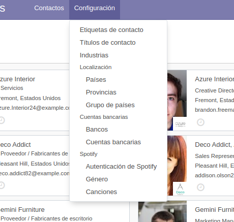
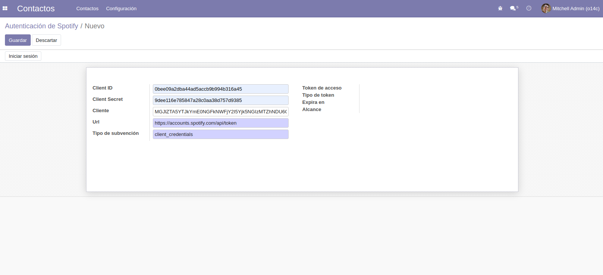
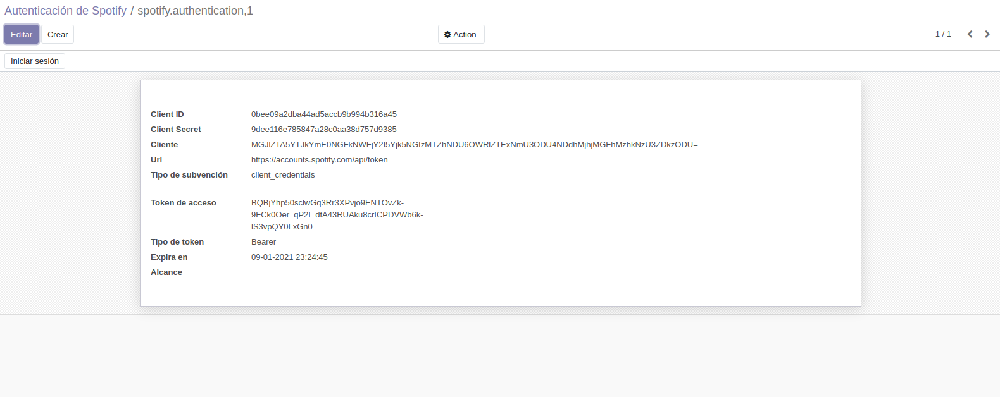
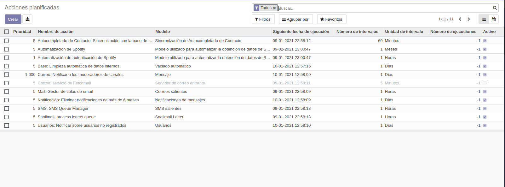
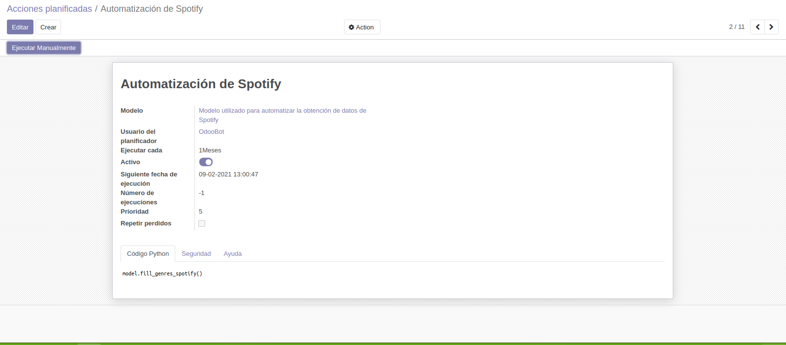
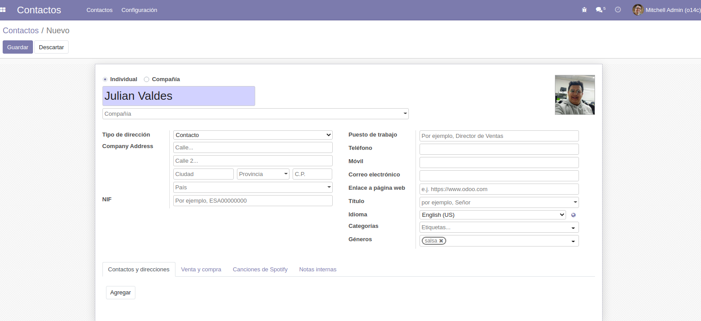
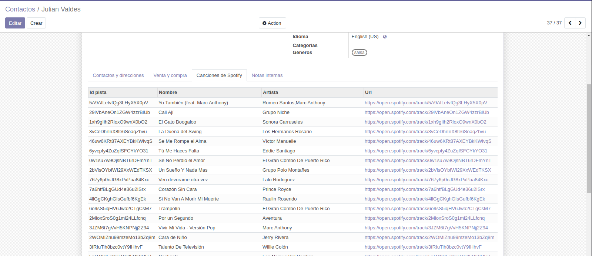

# Prueba_OMNI.PRO

Prueba de conocimiento de Julián Valdés ingreso a OMNI.PRO

### Dependencias

Tkiter : Para interfaz grafica

`sudo apt-get install python3-tk`

Python networkdays : Para el manejo de listas con fechas

`pip install python-networkdays`

## Modulos Odoo

### Spotify

1. Primero configure las credenciales del API en la opcion Autenticación de Spotify en el menu se Configuración de la
   aplicación de Contactos.

2. Cree un nuevo registro y llene los camposcon la respectiva información (si se desa puede usar la informacion de API)

Client ID 0bee09a2dba44ad5accb9b994b316a45 Client Secret 9dee116e785847a28c0aa38d757d9385

Luego de completar los campos, dar clic en iniciar sesión

3. Esperar que el cron actualice el modelo de generos musicales o desde el menu de ajustes>Tecnico>Automatización>
   Acciones planificadas

Buscar Automatización de Spotify, entrar y dar clic en Ejecutar Manualmente

(Esto solo es necesario en caso de que el cron al principio no cargue el modelo de Generos musicales)

### Función Principal

1. En la aplicacion de contactos cree uno nuevo, seleccione un genero

2. De clic en Guardar y luego valla a la pestaña Canciones de Spotify

